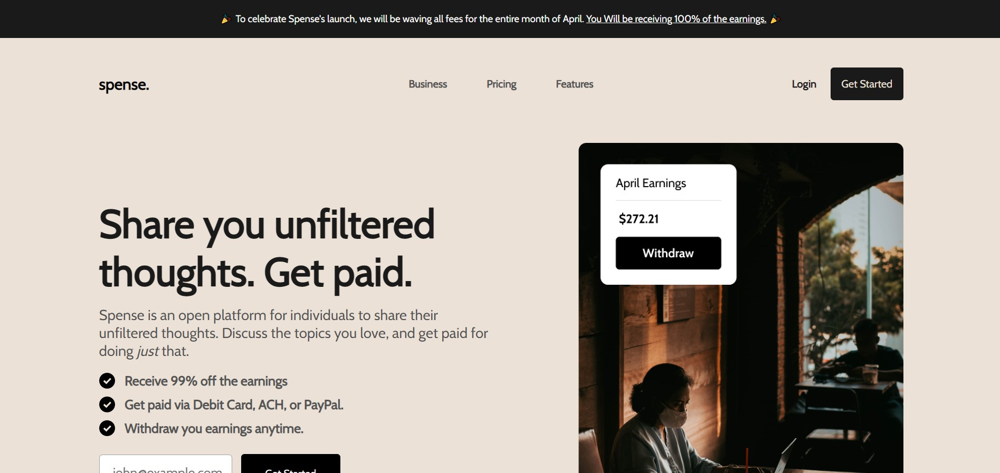
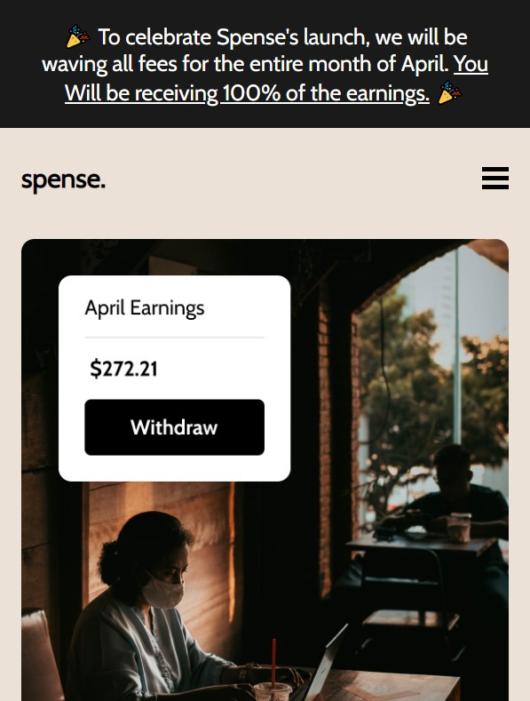

This is a solution to Codewell's [Web Developer Portfolio Challenge](https://www.codewell.cc/challenges/spense-landing-page--608a7a859691700015db16c5).  

## Table of contents

- [Overview](#overview)
  - [The challenge](#the-challenge)
  - [Screenshot](#screenshot)
  - [Links](#links)
- [My process](#my-process)
  - [Built with](#built-with)
  - [What I learned](#what-i-learned)
  - [Continued development](#continued-development)
- [Author](#author)

## Overview

### The challenge

Users should be able to:

- View the optimal layout for the app depending on their device's screen size
- Access drop-down menu when they click the hamburger menu on phone and tablet displays
- 
### Screenshot

### Links

- Solution URL: https://github.com/kowai-onigiri/Spense-Landing-Page
- Live Site URL: https://kowai-onigiri.github.io/Spense-Landing-Page/
## My process

### Built with

- Semantic HTML5 markup
- CSS custom properties
- Flexbox
- Mobile first
- JS DOM manipulation

### What I learned

- Mobile first design
- Responsive techniques
- DOM manipulation

### Continued development

- add pages for each of the links
- add a sign-up / login form page

## Author

- Alexis Chambers (kowai-onigiri)
